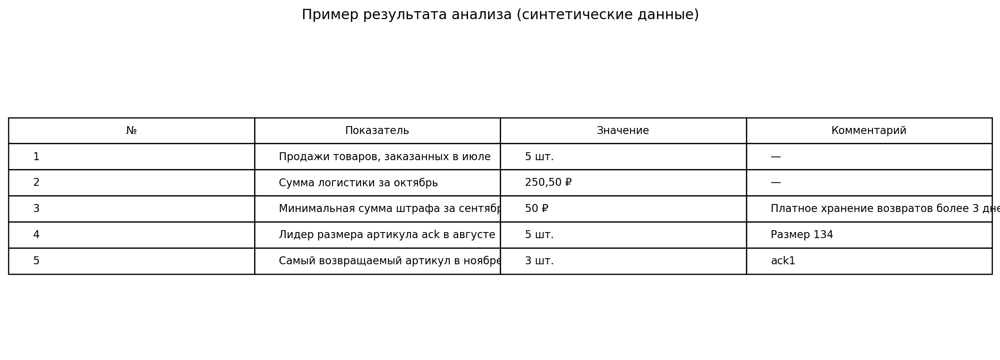

# WB Analytics Report

Учебно-практический проект для анализа Excel-отчёта Wildberries по реализации.

Скрипт обрабатывает отчёт, рассчитывает пять бизнес-показателей и формирует новый Excel-файл с итогами и детализацией.



## Какие задачи решает проект

1. Считает количество продаж товаров, заказанных в июле.
2. Считает сумму логистики за октябрь.
3. Находит статью с наименьшей суммарной величиной штрафа за сентябрь.
4. Определяет лидирующий по продажам размер заданного артикула в августе.
5. Находит артикул, который чаще всего возвращали в ноябре.

## Логика расчётов

| Показатель | Поля и условия |
|---|---|
| Продажи товаров, заказанных в июле | `SUM(quantity)`, месяц `order_dt` = июль, `doc_type_name` = `Продажа` |
| Логистика за октябрь | `SUM(delivery_rub)`, месяц `rr_dt` = октябрь, `supplier_oper_name` = `Логистика` |
| Минимальный штраф за сентябрь | Группировка по `bonus_type_name`, `SUM(penalty)`, месяц `rr_dt` = сентябрь, `penalty > 0` |
| Лидер размера артикула в августе | Группировка по `techSize`, `SUM(quantity)`, месяц `sale_dt` = август, операция `Продажа` |
| Самый возвращаемый артикул в ноябре | Группировка по `Артикул поставщика`, `SUM(quantity)`, месяц `sale_dt` = ноябрь, операция `Возврат` |

## Структура проекта

```text
wb-analytics-report/
├── main.py
├── README.md
├── requirements.txt
├── .gitignore
├── examples/
│   └── sample_sales_report.xlsx
└── screenshots/
    └── result_preview.png
```

## Установка

Требуется Python 3.10 или новее.

### Windows

```bash
python -m venv .venv
.venv\Scripts\activate
pip install -r requirements.txt
```

### macOS / Linux

```bash
python3 -m venv .venv
source .venv/bin/activate
pip install -r requirements.txt
```

## Запуск на демонстрационном файле

```bash
python main.py examples/sample_sales_report.xlsx
```

Результат будет сохранён по пути:

```text
output/analysis_result.xlsx
```

Для выбора другого года и артикула:

```bash
python main.py examples/sample_sales_report.xlsx --year 2023 --article ack
```

Для выбора имени итогового файла:

```bash
python main.py examples/sample_sales_report.xlsx --output output/my_result.xlsx
```

## Результат работы

Создаётся Excel-файл с листами:

- `Итоги`;
- `Штрафы сентябрь`;
- `Продажи ack август`;
- `Возвраты ноябрь`.

## Обезличивание данных

Оригинальный отчёт Wildberries в репозиторий не добавляется.

Файл `examples/sample_sales_report.xlsx` содержит полностью синтетические данные, созданные только для демонстрации работы программы. Перед публикацией собственных файлов необходимо удалить или заменить:

- реальные артикулы и названия брендов;
- баркоды, `nm_id`, `chrtID`;
- `rid`, `rrd_id`, `srid`;
- номера отчётов;
- финансовые показатели клиента;
- другие идентификаторы и коммерческие данные.

Файл `.gitignore` помогает не добавлять в Git другие Excel-файлы, кроме демонстрационного примера. При ручной загрузке через браузер всё равно не выбирайте исходный отчёт.

## Использованные технологии

- Python;
- pandas;
- openpyxl;
- Excel.

## Ограничения

- Названия столбцов должны соответствовать структуре отчёта.
- Скрипт выполняет анализ данных из файла, но не подключается напрямую к API Wildberries.
- Перед использованием на отчётах другого формата потребуется адаптация сопоставления столбцов.

## Об авторе

Проект подготовлен Владимиром Поповым как пример работы с бизнес-требованиями, пользовательскими сценариями, анализом данных и проверкой результатов. При разработке применялись AI-инструменты; бизнес-логика, постановка задачи и приёмка результата выполнялись автором.
